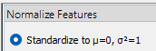
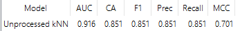
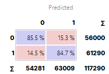
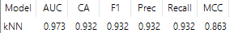
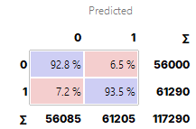
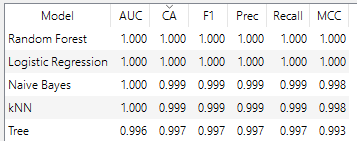
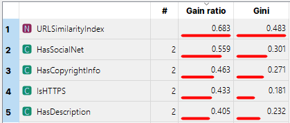
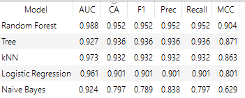
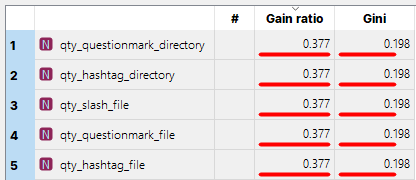

# Datasets

1.  [Dataset 1](https://archive.ics.uci.edu/dataset/967/phiusiil+phishing+url+dataset)
2.  [Dataset 3 (small.csv)](https://github.com/GregaVrbancic/Phishing-Dataset)

## Pré-Processamento

- Datasets não contém missing data.
- Pré-processamento utilizado apenas no kNN

### Exemplo No Dataset 3

#### Sem Pré-Processamento

#### Com Pré-Processamento

## Algoritmos

- kNN
- Árvore de decisão
- Naive Bayes
- Random Forest
- Regressão Logística

## Dataset 1

### Resultados

### Fatores Mais Importantes

## Dataset 2

## Dataset 3

### Resultados

### Fatores Mais Importantes

## Dataset 4