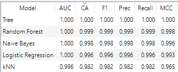
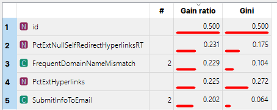
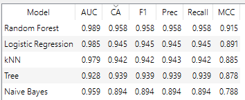
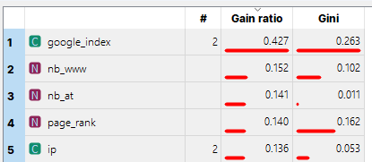

# Datasets

1. [Dataset 1](https://archive.ics.uci.edu/dataset/967/phiusiil+phishing+url+dataset)
2. [Dataset 2](https://www.kaggle.com/datasets/shashwatwork/phishing-dataset-for-machine-learning)
3. [Dataset 3 (small.csv)](https://github.com/GregaVrbancic/Phishing-Dataset)
4. [Dataset 4](https://www.kaggle.com/datasets/shashwatwork/web-page-phishing-detection-dataset)

## Pré-Processamento

- Datasets não contém missing data.
- Pré-processamento utilizado apenas no kNN

### Exemplo No Dataset 3

#### Sem Pré-Processamento

#### Com Pré-Processamento

## Algoritmos

- kNN
- Árvore de decisão
- Naive Bayes
- Random Forest
- Regressão Logística

## Dataset 1

### Resultados

### Fatores Mais Importantes

## Dataset 2

### Resultados

### Fatores Mais Importantes

## Dataset 3

### Resultados

### Fatores Mais Importantes

## Dataset 4

### Resultados

### Fatores Mais Importantes

## Melhor Algoritmo

1. Random Forest
2. Regressão Logística
3. kNN
4. Árvore de Decisão
5. Naive Bayes
